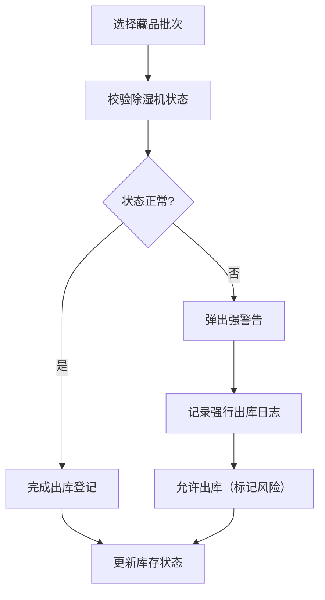

## 1. 产品概述

社区恒温恒湿档案室管理系统，用于除湿机除霜周期监控与藏品质检放行台账管理。解决档案馆除湿机运行监控、湿度预警、藏品出库管控等核心业务问题，目标用户为档案管理员、质检员。

## 2. 核心功能

### 2.1 用户角色

| 角色 | 注册方式 | 核心权限 |
|------|----------|----------|
| 档案管理员 | 系统内置账号 | 除湿机管理、湿度查看、除霜确认、出库登记 |
| 质检员 | 系统内置账号 | 藏品抽检登记、质检数据录入 |

### 2.2 功能模块

1. **除湿机列表页**：展示所有除湿机设备状态，待除霜设备醒目高亮显示
2. **除湿机详情页**：单机制冷区间湿度折线图、除霜历史、除霜操作
3. **待除霜待办页**：待除霜设备列表、一键确认除霜操作
4. **藏品批次管理页**：藏品批次列表、抽检记录、出库登记
5. **数据录入页**：湿度记录录入、抽检结果录入、除霜完成确认

### 2.3 页面详情

| 页面名称 | 模块名称 | 功能描述 |
|-----------|-------------|---------------------|
| 除湿机列表 | 设备卡片列表 | 展示设备名称、除霜间隔、距上次除霜时长、当前状态；待除霜设备红色高亮闪烁 |
| 除湿机列表 | 状态筛选 | 按「全部/正常/待除霜」筛选设备 |
| 除湿机详情 | 湿度折线图 | 展示最近72小时库内相对湿度趋势，58%警戒线标注 |
| 除湿机详情 | 除霜历史 | 展示历史除霜记录及操作人 |
| 除湿机详情 | 除霜操作 | 除霜完成确认按钮，解除待除霜状态 |
| 待除霜待办 | 待办列表 | 展示所有待除霜设备，显示超时时长、湿度异常次数 |
| 待除霜待办 | 批量确认 | 支持批量确认除霜完成 |
| 藏品批次管理 | 批次列表 | 展示藏品批次、所属制冷区间、质检状态、库存状态 |
| 藏品批次管理 | 出库登记 | 登记出库操作，自动校验所属除湿机状态 |
| 数据录入 | 湿度录入 | 每小时录入库内相对湿度 |
| 数据录入 | 抽检录入 | 登记藏品抽检日期与纸张翘曲毫米数 |

## 3. 核心流程

### 3.1 除霜预警流程

1. 系统每小时接收各除湿机制冷区间湿度数据
2. 自动计算每台除湿机距上次除霜时长
3. 触发条件检查：距上次除霜 > 计划间隔 + 6小时 **且** 连续3次湿度 > 58%
4. 满足条件则标记「待除霜」，进入待办列表
5. 待除霜状态下，该机制冷区间内藏品禁止出库
6. 管理员确认除霜完成后，解除待除霜状态，恢复出库权限

### 3.2 出库登记流程

1. 管理员选择藏品批次，点击出库登记
2. 系统校验该批次所属制冷区间的除湿机状态
3. 若除湿机处于「待除霜」状态：
   - 弹出强警告，说明出库风险
   - 记录强行出库操作日志（操作人、时间、批次、原因）
   - 仍允许出库（特殊情况），但标记风险出库
4. 若除湿机状态正常：直接完成出库登记

## 4. 用户界面设计

### 4.1 设计风格

- **主色调**：深青色（#0F4C5C），体现档案管理的专业稳重
- **强调色**：警示红（#E63946）用于待除霜状态，成功绿（#2A9D8F）用于正常状态
- **按钮风格**：圆角8px，带轻微阴影，hover时上浮效果
- **字体**：标题使用「思源宋体」体现文化质感，正文使用「思源黑体」保证可读性
- **布局风格**：侧边导航 + 主内容区，卡片式布局，信息层次分明
- **图标风格**：线性图标，统一2px描边

### 4.2 页面设计概览

| 页面名称 | 模块名称 | UI 元素 |
|-----------|-------------|-------------|
| 除湿机列表 | 设备卡片 | 状态标签（红/绿）、进度条（距下次除霜）、数据网格、hover放大 |
| 除湿机详情 | 湿度折线图 | 渐变填充、58%虚线警戒线、数据点tooltip、平滑曲线 |
| 待除霜待办 | 待办列表 | 红色闪烁边框、倒计时显示、紧急程度标识、醒目操作按钮 |
| 出库登记 | 弹窗 | 双确认机制、风险提示文字加粗、必填原因输入框 |

### 4.3 响应式

- 桌面端：侧边栏导航（240px）+ 主内容区（自适应）
- 平板端：侧边栏可折叠，主内容区单列布局
- 移动端：底部导航栏，卡片堆叠展示，表格横向滚动

### 4.4 视觉动效

- 待除霜设备卡片：红色边框呼吸灯动画（2s循环）
- 湿度超阈值数据点：脉冲动画
- 页面切换：淡入淡出（300ms）
- 按钮点击：缩放反馈（scale(0.97)）
- 数据加载：骨架屏占位 + 渐变动画
